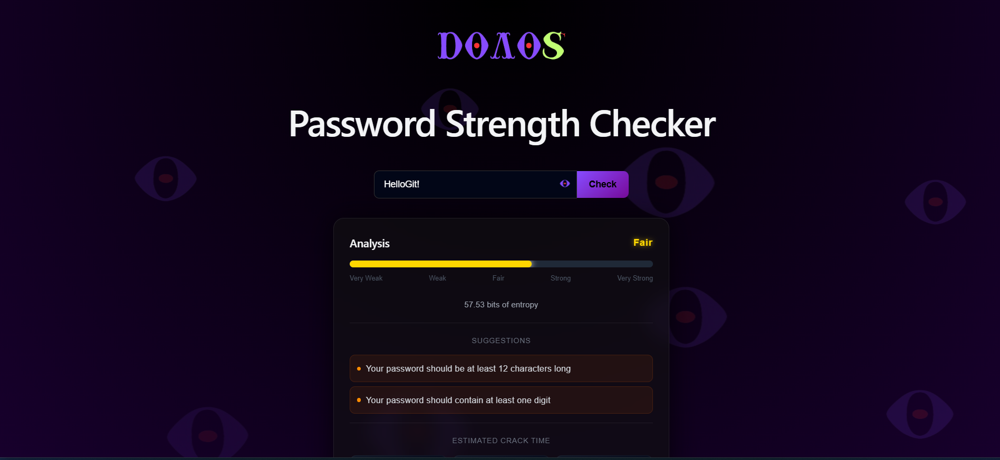

# 🔐 Dolos — AI-Powered Password & Phishing Awareness Platform

Dolos is a full-stack cybersecurity awareness tool designed to simulate real-world password attacks and educate users on how weak credentials and personal information can be exploited.

Built with a focus on **security realism, user experience, and modern web technologies**, Dolos goes beyond traditional password checkers by modeling attacker behavior and providing actionable insights.

---

## 🚀 Features

### 🔑 Password Strength Analysis

* Entropy-based scoring system (realistic, not rule-only)
* Detection of:

  * Weak length & low complexity
  * Repeated characters & predictable patterns
  * Common passwords (10M dataset)
  * Sequential patterns (e.g. `12345`, `qwerty`)
* Strength classification:

  * Compromised / Very Weak / Weak / Fair / Strong / Very Strong

---

### ⚡ Crack Time Estimation

* Simulates real-world attack scenarios:

  * Online attacks (slow)
  * GPU-based offline attacks
  * High-performance cracking rigs
* Displays **average and worst-case cracking times**

---

### 🧠 Personal Info Attack Simulator (🔥 Core Feature)

* Users optionally provide:

  * Name / Surname
  * Birthdate
  * Pet name
  * City
* System generates realistic attacker guesses:

  * `Nick03`, `Nick2003`, `NickBuddy`, etc.
* Each generated password is analyzed and scored

👉 Demonstrates **social engineering risks in real-world attacks**

---

### ⚠️ Personal Information Detection

* Detects if your password contains:

  * Names
  * Birth years
  * Common personal patterns
* Applies scoring penalties and warnings

---

### 🎲 Secure Password Generator

* Generates strong passwords locally using cryptographic randomness
* Never sent to server

---

### 🎨 Modern UI/UX

* Interactive entropy bar with dynamic coloring
* Real-time feedback
* Glassmorphism design
* Smooth animations & responsive layout

---

## 🧱 Tech Stack

### Backend

* **Python**
* **FastAPI**
* Password analysis engine:

  * Entropy calculation
  * Pattern detection
  * Attack simulation logic

---

### Frontend

* **React (Vite)**
* Modern component-based architecture
* Responsive design with custom CSS

---

### Data

* Top 10 Million Passwords dataset
* Optimized using hash-based lookup (`set`) for O(1) performance

---

## 🧠 How It Works

### 1. Entropy-Based Scoring

Instead of simple rules, Dolos calculates password strength using entropy:

* Higher randomness → higher score
* Penalized by real-world weaknesses

---

### 2. Hybrid Security Model

Score =
**Entropy score**
− **Pattern penalties**
− **Common password penalties**
− **Personal data exposure penalties**

---

### 3. Attack Simulation

Dolos simulates how attackers think:

* Dictionary attacks
* Pattern-based attacks
* Social engineering attacks

---

## 🛠️ Installation & Setup

### 1. Clone the repository

```bash
git clone https://github.com/your-username/dolos.git
cd dolos
```

---

### 2. Backend setup

```bash
cd backend
pip install -r requirements.txt
uvicorn main:app --reload
```

Backend runs on:

```
http://127.0.0.1:8000
```

---

### 3. Frontend setup

```bash
cd Dolos
npm install
npm run dev
```

Frontend runs on:

```
http://localhost:5173
```

---

## 🔌 API Endpoints

### POST `/analyze-password`

#### Request:

```json
{
  "password": "example123!",
  "personal_info": {
    "firstName": "Nick",
    "lastName": "Smith",
    "birthdate": "2003-05-03",
    "petName": "Buddy",
    "cityName": "Athens"
  }
}
```

#### Response:

```json
{
  "strength": "Weak",
  "entropy": 42.5,
  "score": 38,
  "issues": [...],
  "crack_time": [...]
}
```

---

## 🎯 Project Goals

* Educate users about **real-world password vulnerabilities**
* Demonstrate **attacker mindset**
* Combine:

  * Cybersecurity
  * AI thinking
  * Full-stack development
  * UI/UX design

---

## 🚀 Future Improvements

* 📧 Phishing email detection module
* 🤖 AI-powered explanations (LLM integration)
* 🔐 Password leak detection via APIs (HaveIBeenPwned)
* 📊 User dashboard & analytics
* 🌐 Deployment (Hostinger / Cloud)

---

## 📌 Why This Project Stands Out

Unlike typical password checkers, Dolos:

✔ Simulates real attacker strategies
✔ Integrates social engineering concepts
✔ Uses entropy + behavioral analysis
✔ Provides educational feedback
✔ Demonstrates full-stack + cybersecurity skills

---

## 👨‍💻 Author

Angelos Skandalis
Informatics & Computer Engineering Student
Cybersecurity • AI • Full-Stack Development

---

## ⚠️ Disclaimer

This project is built for **educational purposes only**.
No user data is stored or transmitted beyond analysis requests.

---

## ⭐ If you like this project

Give it a star ⭐ and feel free to contribute!
