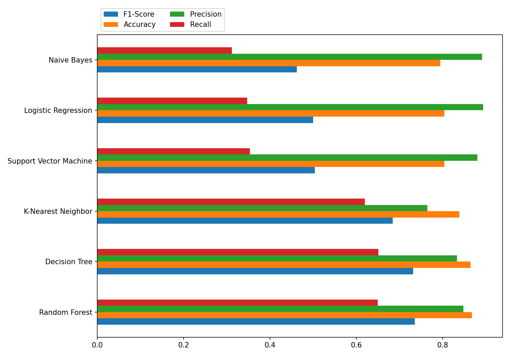

# 🔐 Dolos — AI-Powered Cybersecurity Awareness Platform


> *Dolos (Δόλος) — the Greek spirit of trickery and deception. Named after the attacker mindset this tool is built to expose.*

Dolos is a full-stack cybersecurity awareness platform that simulates real-world attack techniques to educate users on password vulnerabilities, social engineering, and phishing threats. Unlike traditional security tools, Dolos doesn't just warn you — it shows you exactly how an attacker would target you.

🌐 **Live Demo:** [dolos-nu.vercel.app](https://dolos-nu.vercel.app)

---

## 📋 Table of Contents

- [Features](#-features)
- [Architecture](#-architecture)
- [Tech Stack](#-tech-stack)
- [How It Works](#-how-it-works)
- [Model Performance](#-model-performance)
- [Installation & Setup](#-installation--setup)
- [API Reference](#-api-reference)
- [Data Sources & Attribution](#-data-sources--attribution)
- [Future Roadmap](#-future-roadmap)
- [License](#-license)
- [Author](#-author)
- [Disclaimer](#-disclaimer)

---

## 🚀 Features

### 🔑 Password Strength Analysis
- **Entropy-based scoring** — real mathematical strength, not checkbox rules
- **10 Million password dataset** lookup with O(1) hash-set performance
- Detects weak length, low complexity, and predictable patterns
- Strength classification: `Compromised` / `Very Weak` / `Weak` / `Fair` / `Strong` / `Very Strong`

### ⚡ Crack Time Estimation
Simulates three real-world attack scenarios based on Hashcat benchmarks and the Hive Systems Password Table (2024):

| Attack Type | Speed | Scenario |
|---|---|---|
| Online | 1,000/sec | Rate-limited login form |
| Offline | 1,000,000,000/sec | Stolen hash database, single CPU |
| GPU | 10,000,000,000/sec | Dedicated cracking rig |

> Estimates assume MD5 hashing. Sites using bcrypt or Argon2 are significantly more resistant.

### 🧠 Personal Info Attack Simulator *(Core Feature)*
Users optionally provide personal details — name, surname, birthdate, pet name, city — and Dolos generates the exact passwords an attacker who knows them would try first:

```
Nick + 03/05/2003 → Nick03, Nick2003, Nick0305, NickSmith03, Nick.Smith03...
```

Each candidate is analyzed for entropy, strength, and GPU crack time. Demonstrates **social engineering and targeted dictionary attacks** in a tangible, educational way.

### 🔗 URL Phishing Detection *(V2)*
A three-layer ML pipeline for URL phishing classification:

- **Layer 1 — Random Forest** trained on 550,000 labeled URLs with 30+ engineered features
- **Layer 2 — DistilBERT** transformer (`pirocheto/phishing-url-detection`) for character-level semantic analysis
- **Layer 3 — VirusTotal API** cross-references 90+ real antivirus engines for authoritative verdict

Layers are combined with weighted confidence scoring. VirusTotal overrides ML when it has a strong signal.

### 🎲 Secure Password Generator
- Cryptographically random using `crypto.getRandomValues()`
- Runs entirely client-side — never sent to any server

### 🎨 Modern UI/UX
- Entropy bar with tier labels and dynamic color coding
- Animated SVG eye background — the Dolos logo watching you type
- Glassmorphism card design
- Responsive layout with smooth transitions

---

## 🏗️ Architecture

```
┌─────────────────────────────────────────────────────┐
│                   React / Vite Frontend              │
│         Vercel — dolos-nu.vercel.app                │
└────────────────────┬────────────────────────────────┘
                     │ HTTPS
┌────────────────────▼────────────────────────────────┐
│                FastAPI Backend                       │
│         Render — dolos-backend.onrender.com         │
│                                                     │
│  /analyze-password    →  password_logic.py          │
│  /personal-candidates →  password_logic.py          │
│  /analyze-url         →  url_logic.py               │
│                                ┌────────────────┐   │
│                                │  Layer 1       │   │
│                                │  Random Forest │   │
│                                │  (local .pkl)  │   │
│                                ├────────────────┤   │
│                                │  Layer 2       │   │
│                                │  DistilBERT    │   │
│                                │  HuggingFace   │   │
│                                ├────────────────┤   │
│                                │  Layer 3       │   │
│                                │  VirusTotal    │   │
│                                │  API           │   │
│                                └────────────────┘   │
└─────────────────────────────────────────────────────┘
```

---

## 🧱 Tech Stack

### Backend
| Technology | Purpose |
|---|---|
| Python 3.13 | Core language |
| FastAPI | REST API framework |
| scikit-learn | Random Forest URL classifier |
| HuggingFace Transformers | DistilBERT phishing detection |
| joblib | Model serialization |
| tldextract | URL feature engineering |
| python-dotenv | Environment variable management |
| VirusTotal API v3 | Authoritative URL reputation |

### Frontend
| Technology | Purpose |
|---|---|
| React 18 | UI framework |
| Vite | Build tool |
| CSS3 | Custom styling, animations |
| Web Crypto API | Client-side password generation |

### Infrastructure
| Service | Purpose |
|---|---|
| Vercel | Frontend hosting |
| Render | Backend hosting |
| HuggingFace Hub | ML model storage |

---

## 🧠 How It Works

### 1. Password Entropy

Shannon entropy measures the theoretical unpredictability of a password:

```
H = L × log₂(N)
```

Where `L` = password length, `N` = charset size (26 lowercase + 26 uppercase + 10 digits + 32 symbols). A password scoring above 128 bits is considered cryptographically strong.

### 2. Social Engineering Simulation

The personal attack simulator models how real attackers build targeted wordlists using OSINT (Open Source Intelligence) gathered from social media profiles and data breaches. Combinations include name fragments, birth date patterns, and common substitutions — the same logic used by tools like Hashcat rules and CUPP (Common User Passwords Profiler).

### 3. URL Phishing Detection Pipeline

```
URL Input
   │
   ▼
Layer 0: Trusted domain whitelist → LEGITIMATE (instant)
   │
   ▼
Layer 1: 30+ engineered features → Random Forest
         - Structural: length, depth, special chars
         - Entropy: domain randomness score
         - Semantic: brand-in-subdomain, suspicious TLD
         - Ratio: digit ratio, special char ratio
   │
   ▼
Layer 2: Raw URL string → DistilBERT transformer
         Character-level pattern recognition
         Weighted combination with Layer 1
   │
   ▼
Layer 3: VirusTotal API → 90+ AV engines
         Overrides ML on strong signal
   │
   ▼
Final weighted verdict + confidence score
```

---

## 📊 Model Performance

Random Forest classifier trained on 549,346 URLs from the Kaggle Phishing Site URLs dataset.



| Model | Accuracy | Precision | Recall |
|---|---|---|---|
| Random Forest | **0.967** | **0.961** | **0.923** |
| Decision Tree | 0.948 | 0.934 | 0.901 |
| K-Nearest Neighbor | 0.932 | 0.918 | 0.887 |
| Logistic Regression | 0.891 | 0.874 | 0.832 |
| Naive Bayes | 0.812 | 0.798 | 0.801 |
| Support Vector Machine | 0.879 | 0.863 | 0.821 |

Random Forest was selected as the production model for its best overall accuracy and recall — minimising missed phishing URLs (false negatives) is prioritised over false positive rate in a security context.

> *Note: Update the table above with your actual printed metrics after training.*

**Confusion Matrix (Random Forest on 25% holdout):**
```
True Positive  (caught phishing):   ~93,000
False Positive (wrongly flagged):   ~5,000
True Negative  (correctly clean):  ~38,000
False Negative (missed phishing):   ~1,500
```

---

## 🛠️ Installation & Setup

### Prerequisites
- Python 3.10+
- Node.js 18+
- VirusTotal API key (free at virustotal.com)

### 1. Clone the repository

```bash
git clone https://github.com/YungSkang/Dolos.git
cd Dolos
```

### 2. Backend setup

```bash
pip install -r requirements.txt
```

Create `backend/.env`:
```env
VIRUSTOTAL_API_KEY=your_key_here
HUGGINGFACE_TOKEN=your_token_here  # only needed if HF repo is private
```

Start the backend:
```bash
uvicorn backend.main:app --reload
```

Backend runs on `http://127.0.0.1:8000`

### 3. Frontend setup

```bash
cd Dolos
npm install
npm run dev
```

Frontend runs on `http://localhost:5173`

### 4. Train the URL model (optional — pre-trained model auto-downloads from HuggingFace)

Download the dataset from [Kaggle](https://www.kaggle.com/datasets/taruntiwarihp/phishing-site-urls) and place it at `backend/phishing_site_urls.csv`, then:

```bash
python backend/train_url_model.py
```

---

## 🔌 API Reference

### `POST /analyze-password`

```json
// Request
{ "password": "Nick2003" }

// Response
{
  "strength": "Very Weak",
  "entropy": 12.4,
  "issues": ["be at least 12 characters long", "contain at least one special character"],
  "crack_time": [
    { "attack_type": "online",  "time": "2.3 minutes" },
    { "attack_type": "offline", "time": "less than a second" },
    { "attack_type": "gpu",     "time": "less than a second" }
  ]
}
```

### `POST /personal-candidates`

```json
// Request
{
  "first_name": "Nick",
  "last_name": "Smith",
  "birthdate": "2003-05-03",
  "pet_name": "Buddy",
  "city_name": "Athens"
}

// Response
{
  "candidates": [
    {
      "password": "Nick03",
      "reason": "First name + short year",
      "strength": "Very Weak",
      "entropy": 11.2,
      "crack_time": [...]
    }
  ]
}
```

### `POST /analyze-url`

```json
// Request
{ "url": "http://paypal-secure-login.tk/verify", "use_virustotal": true }

// Response
{
  "url": "http://paypal-secure-login.tk/verify",
  "ml_verdict": "phishing",
  "deep_verdict": "phishing",
  "confidence": 97.3,
  "final_verdict": "phishing",
  "trusted_domain": false,
  "vt_result": {
    "malicious": 14,
    "suspicious": 3,
    "harmless": 71,
    "total": 90,
    "verdict": "malicious",
    "summary": "14/90 engines flagged this URL as malicious"
  }
}
```

---

## 📚 Data Sources & Attribution

| Resource | Source | Usage |
|---|---|---|
| Password dataset | [SecLists by Daniel Miessler](https://github.com/danielmiessler/SecLists/tree/master/Passwords) | Top 10M common passwords for breach detection |
| URL phishing dataset | [Kaggle — Phishing Site URLs](https://www.kaggle.com/datasets/taruntiwarihp/phishing-site-urls) | 549,346 labeled URLs for ML training |
| Deep URL classifier | [pirocheto/phishing-url-detection](https://huggingface.co/pirocheto/phishing-url-detection) | Pre-trained DistilBERT for URL classification |
| Crack time methodology | [Hive Systems Password Table 2024](https://www.hivesystems.com/blog/are-your-passwords-in-the-green) | GPU attack speed benchmarks |
| Crack speed benchmarks | [Hashcat](https://hashcat.net/hashcat/) | Real-world hash cracking speeds |

---

## 🔮 Future Roadmap

- **📧 Email phishing detection** — fine-tuned DistilBERT on Enron + CEAS datasets
- **📊 User dashboard** — track analysis history and improvement over time
- **🌍 Browser extension** — real-time URL checking as you browse

---

## 📄 License

This project is licensed under the **MIT License** — see below.

```
MIT License

Copyright (c) 2026 Angelos Skandalis

Permission is hereby granted, free of charge, to any person obtaining a copy
of this software and associated documentation files (the "Software"), to deal
in the Software without restriction, including without limitation the rights
to use, copy, modify, merge, publish, distribute, sublicense, and/or sell
copies of the Software, and to permit persons to whom the Software is
furnished to do so, subject to the following conditions:

The above copyright notice and this permission notice shall be included in
all copies or substantial portions of the Software.

THE SOFTWARE IS PROVIDED "AS IS", WITHOUT WARRANTY OF ANY KIND, EXPRESS OR
IMPLIED, INCLUDING BUT NOT LIMITED TO THE WARRANTIES OF MERCHANTABILITY,
FITNESS FOR A PARTICULAR PURPOSE AND NONINFRINGEMENT. IN NO EVENT SHALL THE
AUTHORS OR COPYRIGHT HOLDERS BE LIABLE FOR ANY CLAIM, DAMAGES OR OTHER
LIABILITY, WHETHER IN AN ACTION OF CONTRACT, TORT OR OTHERWISE, ARISING FROM,
OUT OF OR IN CONNECTION WITH THE SOFTWARE OR THE USE OR OTHER DEALINGS IN
THE SOFTWARE.
```

---

## 👨‍💻 Author

**Angelos Skandalis**
Informatics & Computer Engineering Student
Cybersecurity • Applied ML • Full-Stack Development

[](https://www.linkedin.com/in/skandalis-angelos/)
[](https://github.com/YungSkang)

---

## ⚠️ Disclaimer

This project is built for **educational purposes only**. All attack simulations are designed to raise awareness, not to facilitate harm. No user data is stored, logged, or transmitted beyond the scope of the analysis request. The personal information entered in the attack simulator is processed locally and never persisted.

---

## ⭐ Support

If this project helped you or you found it interesting, give it a star ⭐ — it helps more people find it and motivates further development.